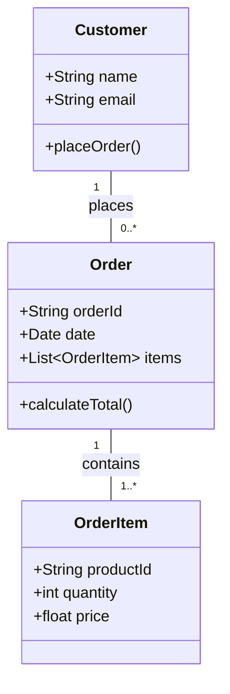
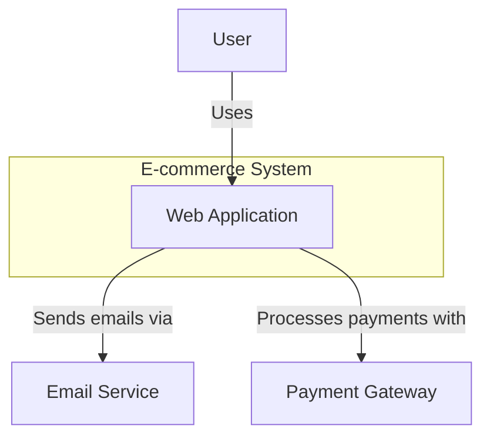
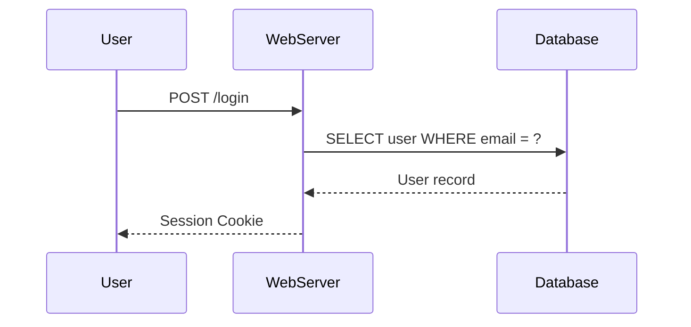

# Design & Diagrams
## Visualizing Software Architecture

*Communicating complex systems through clear diagrams*

---

## Why Use Diagrams?

> **"A picture is worth a thousand words"**

- **Clarity** - Simplify complex ideas
- **Communication** - Align team and stakeholder understanding
- **Analysis** - Identify design flaws and opportunities
- **Documentation** - Provide a long-lasting reference

---

# Types of Diagrams

## Common Architectural & Design Diagrams:

1.  **UML Diagrams** (Unified Modeling Language)
2.  **C4 Model** (Context, Containers, Components, Code)
3.  **Sequence Diagrams**
4.  **Flowcharts**
5.  **Entity-Relationship Diagrams (ERD)**

---

# 1. UML Diagrams

## A Standard for Software Modeling

### **Structural Diagrams:**
- **Class Diagram** - Shows class structure and relationships
- **Component Diagram** - Shows how components are wired together
- **Deployment Diagram** - Shows how software is deployed to hardware

### **Behavioral Diagrams:**
- **Use Case Diagram** - Describes user interactions
- **Activity Diagram** - Shows workflow and business processes
- **Sequence Diagram** - Shows object interactions over time

---

## UML Class Diagram Example

*This diagram shows the static relationship between Customer, Order, and OrderItem classes.*

---

# 2. The C4 Model

## For Visualizing Software Architecture

A simple, hierarchical way to describe software architecture at different zoom levels.

- **Level 1: System Context** - The big picture
- **Level 2: Containers** - Applications and data stores
- **Level 3: Components** - Parts of a container
- **Level 4: Code** - Implementation details (optional)

---

## C4 - Level 1: System Context

Shows how your system fits into the world around it.

*High-level view showing the system and its key external dependencies.*

---

# 3. Sequence Diagrams

## Visualizing Interactions Over Time

Shows how objects or components interact in a specific scenario.

- Excellent for understanding the flow of a use case
- Helps identify performance bottlenecks
- Clarifies complex interactions

---

## Sequence Diagram Example

*This diagram shows the sequence of events for a user login.*

---

# When to Use Which Diagram

| Goal | Recommended Diagram |
|---|---|
| **Show static structure** | UML Class Diagram |
| **Describe a user workflow** | UML Activity Diagram / Flowchart |
| **Show object interactions** | UML Sequence Diagram |
| **High-level system overview** | C4 Context Diagram |
| **Show database schema** | Entity-Relationship Diagram (ERD) |

---

# Tools for Diagramming

## As Code & GUI

### **Diagrams as Code:**
- **Mermaid.js** - (Used in these slides!) Markdown-like syntax
- **PlantUML** - Powerful, extensive UML support
- **Structurizr** - C4 modeling tool

### **GUI Tools:**
- **Lucidchart** - Collaborative online diagramming
- **draw.io (diagrams.net)** - Free and powerful
- **Miro** - Digital whiteboard with diagramming tools

---

# Key Takeaways

1.  **Choose the Right Tool** - Use the simplest diagram that communicates the idea.
2.  **Be Consistent** - Use a consistent notation and style.
3.  **Keep it Updated** - Out-of-date diagrams are worse than no diagrams.
4.  **Focus on Communication** - The goal is shared understanding, not perfect notation.

---

# Questions & Discussion

## Discussion Points:
- What diagrams have you found most useful?
- What are the challenges of keeping diagrams up-to-date?
- How do you integrate diagrams into your development workflow?

---

# Thank You

## Next Steps:
- **Practice creating a diagram** for a recent feature.
- **Explore a "Diagrams as Code" tool** like Mermaid.js.
- **Add a diagram** to your project's documentation.
